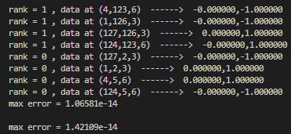

## GPU_FFT : A FFT DEVELOPED FOR MULTI-NODE MULTI-GPU WORKLOADS

This FFT was developed by **Manthan Verma** , Soumyadeep chatterjee and Prof Mahendra Verma in collaboration with **NVIDIA**.

This is a Open-source parallel FFT primarily for GPUs **(Either AMD or NVIDIA)**.
This FFT has been tested on **NVIDIA's A100 and AMD INSTINCT MI210 Accelerator GPUs**.
It Has been tested and scaled on various supercomputers like **selene**, **Param-Siddhi_AI**, **Param-sanganak** etc.
## CITTING THIS FFT

This FFT has been published in **S.N. Comp. Sci.** in  Volume 4, article number 625, (2023). \
Link to the Research paper is : "https://link.springer.com/article/10.1007/s42979-023-02109-0".  
To Cite this article use-- "**Verma, M., Chatterjee, S., Garg, G. et al. Scalable Multi-node Fast Fourier Transform on GPUs. SN COMPUT. SCI. 4, 625 (2023). https://doi.org/10.1007/s42979-023-02109-0**"

<!-- ## SCALING AND BENCHMARKS

We focus on communication and computations times, which are denoted by Tcomp and Tcomm , respectively. Note that the total time T = Tcomp + Tcomm. Here, we report the timmings of a pair of FFTs Forward + Inverse. -->

## INSTALLING GPU_FFT

Installation is very simple. Follow the following steps :

1. Clone this GIT-REPO and go to GPU_FFT folder
2. Make sure you have " CUDA-AWARE MPI and CUDA " are installed in your system.
3. Now do \
`make CUDA_HOME=<ENTER_CUDA_HOME_DIRECTORY> MPI_HOME=<CUDA_AWARE_MPI_HOME_DIRECTORY>`
4. Now , do \
`make INSTALL_DIR=<INSTALLATION_PATH> install`
5. GPU_FFT will be install in the specified folder path.

## USING GPU_FFT
First, make sure the Include and library directories of installed library is in path.
Then , in your code include :/
`#include <GPU_FFT/GPU_FFT.h>`

Now, just after initializing the FFT do \
`cudaSetDevice()`.\
Now, in your code make an object to the GPU_FFT class as :\
`GPU_FFT<T1,T2> *FFT = new GPU_FFT<T1,T2>{Nx,Ny,Nz,procs,rank,MPI_COMMUNICATOR}`

Here, Nx, Ny, Nz are the dimesnions in real space of the data to be Transformed. procs and rank are the mpi size and rank respectively. MPI_COMMUNICATOR is the COMMUNICATOR with which you want to use the FFT with.

Here, T1 and T2 are the templated variables, Where T1 and T2 can be either "float" and "cufftComplex" for single precision or "double" and "cufftDoubleComplex" for double precision. This code supports both single as well as double precision only.

Now initialize the GPU_FFT using `FFT->INIT_GPU_FFT()`.

Now you can use the FFT using ,
`FFT->GPU_FFT_R2C(T1 *data)` or `FFT->GPU_FFT_C2R(T2 *data)`. Where both these functions does the FFT inplace only.

In the end destroy the FFT using `FFT->~GPU_FFT()`.

## Testing GPU_FFT Installation
A Basic installation script is provided in GPU_FFT_TEST_SCRIPT folder. Do a make in TEST_SCRIPT folder by setting the relative parameters in make file. and then do `make test_fft Nx=128 Ny=128 Ny=128`

Here we have used a real function :: $f (x, y, z) = 8 sin(x) sin(2y) sin(3z) + 8 sin(4x) sin(5y) sin(6z)$, \
output will be :

`

`

## Comparing this FFT with FFTK(CPU BASED FFT DEVELOPED IN OUR LAB)
Time of multicore FFT of $1536^3$ grid with 196608 cores of Cray XC40 is comparable to that of GPU-FFT of $2048^3$ grid with 128 GPUs.

## FUTURE UPDATES ON THIS LIBRARY
We have developed a wrapper around this library for using in python as well.
Which will be soon availaible on this repository.\
We also have a better version of this FFT that use NVSHMEMS for communication ans is stream aware. This version is currently not open source and can be provided on specific demand submitted on manver@iitk.ac.in or in this repository. This new FFT is suppose to be better than cuFFTMp itself. 